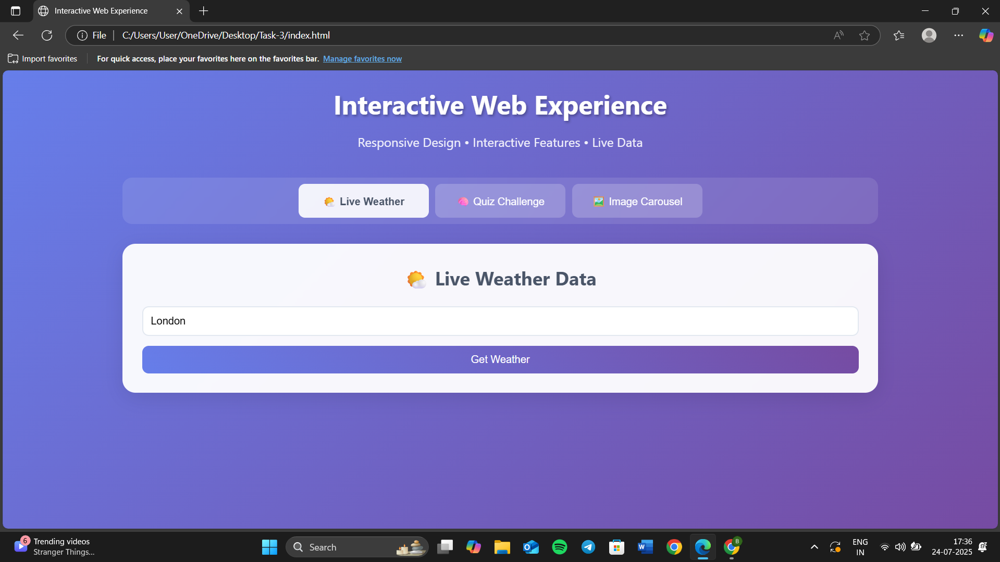
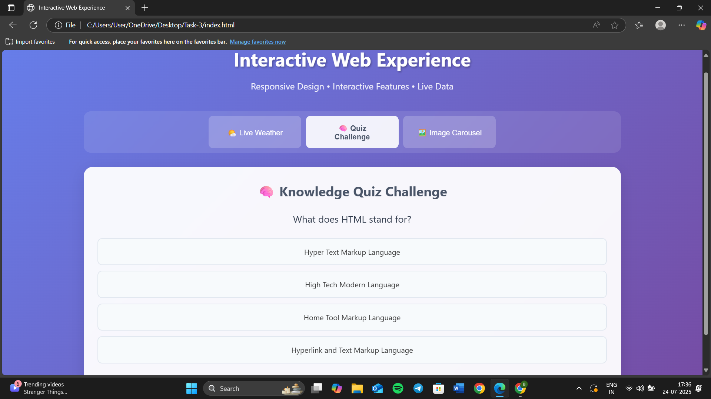
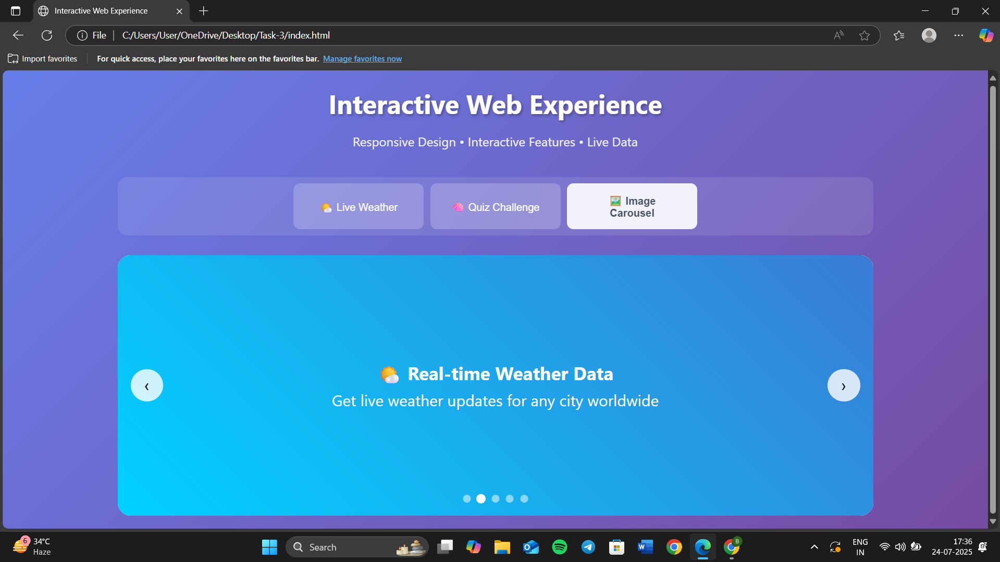

# 🌐 Task 3 – Interactive Web App  
**Internship Project | ApexPlanet Software Pvt. Ltd.**

This project is a part of my internship training, showcasing my ability to build a **multi-feature responsive web application** using **HTML, CSS, and JavaScript**. It combines real-time data, interactive elements, and visually dynamic features for an engaging user experience.

---

## 🎯 Objective

- Integrate a **Weather API** for real-time data fetching  
- Build an interactive **Quiz** with scoring logic  
- Implement an **Auto-rotating Image Carousel**  
- Design a **fully responsive layout** for all screen sizes  

---

## 🧩 Features

✅ Real-time **Weather App** 
✅ **Quiz App** with multiple questions and score tracking  
✅ **Image Carousel** with auto-slide functionality  
✅ **Responsive Design** with smooth transitions and media queries  
✅ Clean UI with consistent color palette and hover effects  

---

## 🔧 Technologies Used

- **HTML5** – for semantic structure  
- **CSS3** – for styling, layout, and responsive design  
- **JavaScript (Vanilla)** – for dynamic functionalities and interactivity  
- **Weather API** – to fetch real-time weather data  

---

## 📂 Project Structure

├──index.html # Main HTML file

├── style.css # CSS for styling and layout

├── script.js # JavaScript for functionality (API, quiz, carousel)

---

## ▶️ How to Run Locally

1. **Clone or download** this repository  
2. Open `index.html` in your preferred browser  
3. Explore the weather info, play the quiz, and view the carousel!

---

## 👩‍💻 Developed By  
**Bharti Johari**  
Intern @ ApexPlanet Software Pvt. Ltd.  
🎓 BTech CSE (AI & ML) | Sanskriti University  
🌐 Web Development Enthusiast 

---

## 🚀 Live Demo  
🔗 [Click here to view the live project]() 

---

## 📸 Screenshots

🔹 **Weather App Section**

   
  
🔹 **Quiz Section**  
   
  
  
🔹 **Image Carousel Section**
  
  
  
---

## 📌 Learnings & Takeaways

- Working with **APIs and async JS**  
- Building logic-heavy components like quizzes  
- Creating responsive UIs using **CSS media queries**  
- Strengthened my **problem-solving and DOM manipulation** skills

---
